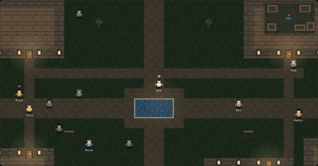
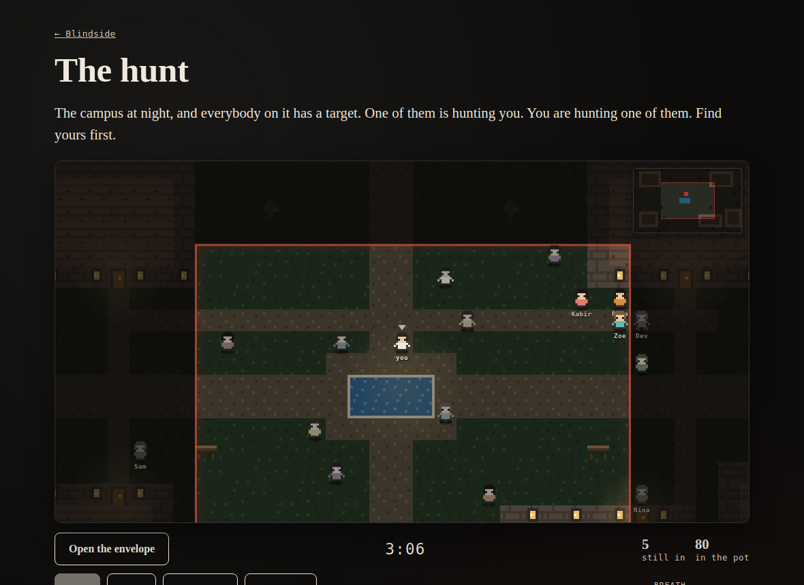
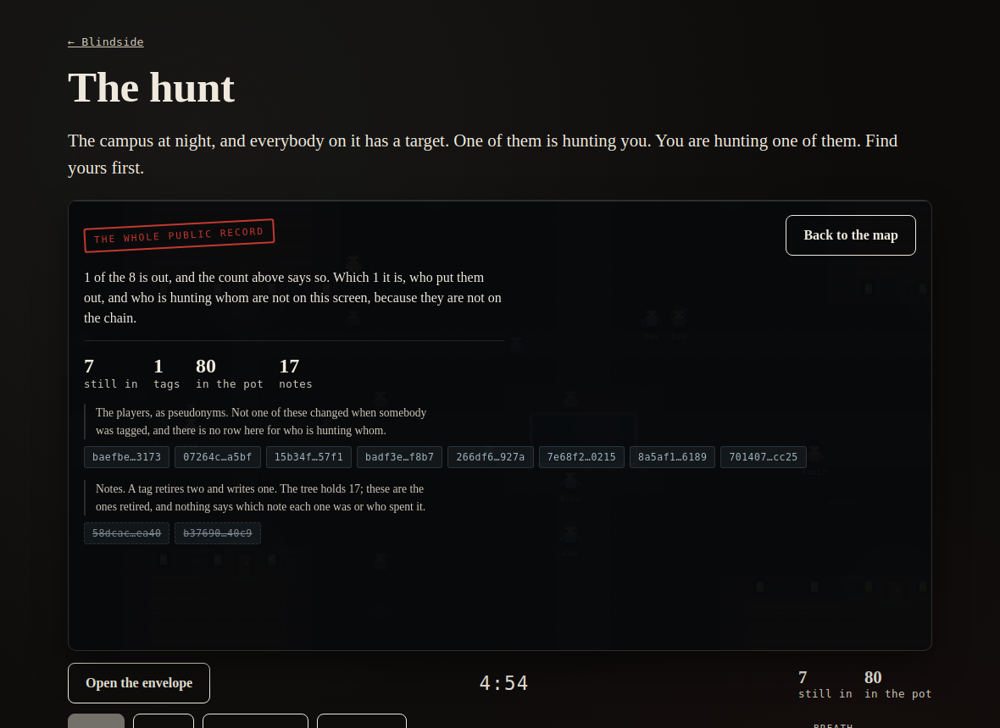

# Blindside

**Everyone has a target. Nobody knows who has them.**



*One take, at the speed it plays. Nothing here is a mockup.*

Blindside is a hidden-target tag game on [Midnight](https://midnight.network). You are secretly
assigned one other player to tag. When you get them, they say **five words** out loud; those words
are the only key that opens their half of the game, a zero-knowledge proof settles the tag on chain
without revealing who tagged whom, and you inherit their target. The last player standing proves it
and the contract pays out the pot.

The genre is Senior Assassin, office Killer, campus Assassins. Millions of people play it every
year over group chats and spreadsheets, with the prize money moving through the organizer's
personal payment app.

**The handover is five spoken words, so a game is not limited to people who can stand next to each
other.** Say them in a corridor, down a phone, on a video call, in a direct message. That is the
difference between a game one campus can play and a game a Discord server can play.

## What this does that an app with a database cannot

1. **A pot nobody can run off with, and nobody can trap.** Entry fees sit in the contract. It pays
   only the player who proves they are last. There is no organizer withdrawal, and a deadline plus
   a resign path mean one stubborn or absent player cannot lock the money up forever.
2. **The chain never learns who tagged whom.** Tags are proofs over hidden notes. The public feed
   says "someone was tagged, 11 remain", and that is all it can say.
3. **Tags nobody can fake, payouts nobody can redirect.** A tag needs the victim's five words *and*
   the hunter's own secret and their own note, so overhearing the words gets a stranger nothing.
   The payout address is fixed when you join, so a stolen phone cannot send the pot somewhere new.
4. **No server of its own.** After the game starts the organizer publishes one line of text: every
   player's sealed part of the game, shuffled and padded. It can go in the group chat, because it
   is entirely ciphertext. Players read their own target out of it, and a hunter opens their
   victim's half with the words they just heard. Nothing has to be passed between two phones.

## What this version does not do

Stated plainly, because a privacy product that overclaims is worse than one that admits a limit:

- **The organizer builds the cycle, so the organizer knows the map.** They cannot fake a tag and
  cannot touch the pot, but they can see who is hunting whom. Removing that is the next milestone.
- **A player who refuses to surrender can force a draw.** At the deadline everyone, tagged or
  alive, gets their entry fee back. Refusing can never win the pot, but it can end the game. The
  alternative, letting the organizer eliminate people, would let them hand the pot to a friend.
- **Sixteen players per game** in this version.
- **Testnet only.** Real money needs mainnet and a legal review first.

## The handover, in one paragraph

A tag needs 96 bytes of the victim's private note. Nobody can read 96 bytes aloud, so the bytes are
published as ciphertext and the **key** is what gets said. Five words from the 2048-word BIP-39
list are 55 bits; the key is derived from them with Argon2id at 19 MiB, so a legitimate hunter pays
one derivation, around a third of a second, and anybody guessing pays it 36 quadrillion times. The
organizer seals each player's target to that key and cannot open it again, because the key exists
nowhere until its owner says the words.

## How the game maps onto the cryptography

Each "A hunts B" is a hidden note in a Merkle tree, blinded with fresh randomness. A tag spends two
notes and creates one:

```
before   A -> B -> C
tag      spend (A -> B), spend (B -> C), create (A -> C) with new randomness
after    A -> C
```

The chain sees two nullifiers that cannot be tied back to the notes they retire, plus one new leaf.
It does not see A, B, or C. The last tag leaves the winner pointing at themselves, and that
self-loop is the proof of victory.

## Play it in two minutes, without a wallet

**[playblindside.vercel.app](https://playblindside.vercel.app/)**

Or watch a minute and a quarter of it first: [docs/demo.mp4](docs/demo.mp4), silent, one take of a
four player hunt. The choice, the walk, a tag, the five words, the public record, the grounds
closing. It is recorded by playing the game rather than by editing footage together, which is why
it sits in the repository next to the code that makes it.

**The hunt** is a place at night, drawn in pixels, with four, eight or twelve players on it and
ten strangers who are not in the game. One of them is hunting you and you do not know which. You
are hunting one of them: open your envelope, listen to the rumours, get to them before your
hunter gets to you. Buildings and trees hide whoever is behind them. Standing in a crowd hides
you. Running is fast and loud, and your hunter can hear it. When you have somebody, they stop and
say five words, once, and you type what you heard.

There are two places and they play differently. The campus is buildings and crowds: you hide
indoors, or in a knot of strangers. The park is a wood down one side and open lawn in the middle,
where a tree line is the only thing between you and whoever is looking.

The whole place sits in the corner of the screen, with you on it and a circle where the last
rumour put your target. Nobody else is ever drawn on it, because nobody else's position is ever
given to it.

Three quarters of a minute in, **the grounds start closing**. The open ground shrinks towards the
middle and the crowd drifts in with it. Nobody is walled in: step outside the line and there is
nobody left out there to hide behind, and your hunter is told where you are every few seconds.
The last minute is everybody in one courtyard, which is where it should end.



Every join, tag, refusal, payout and refund in it runs the **real compiled contract in your
browser tab**. The place, the rumours and everybody else on it are a game about the real one.

Press **The chain** at any point and the map is replaced, in place, by everything an observer
holding the whole ledger can read at that moment. The counts move while you watch. The list of
people does not, because that list is the whole of what the chain knows about people. That
contrast, in one button, is the product.



Two feeds sit under the map as well. *What you saw* is the place: who went into the Library, who
is out, where your target was last seen. *What the chain sees* is two spent notes and one new
one. The same tag, side by side.

[The paper version](https://playblindside.vercel.app/#/sandbox) is the same
contract with the buttons showing. Play a whole game, win it, claim the pot. Then press the
buttons under "When it goes wrong" and watch the pot come back out of a game nobody finished.

The same site has an [evidence page](https://playblindside.vercel.app/#/evidence)
showing a game played on a real chain, and a
[spectator view](https://playblindside.vercel.app/#/watch) that reads a deployed
game straight out of a Midnight indexer.

Or run it yourself:

```bash
pnpm install
pnpm --filter @blindside/app dev     # then press "Play the hunt"
```

## On the night: your phone

[The phone page](https://playblindside.vercel.app/#/me) is what a player in a
real game needs and nothing else. Keep the five words the organizer gave you. Paste the bundle
from the group chat. Open the envelope: your target, readable only with your words. When you get
them, type the five words they said and the page checks them the way the contract will, before
anybody walks to the organizer. Nothing on it talks to a server, and the words stay on the phone
until you tell it to forget them.

In this version the organizer's console settles tags on chain, because proving a tag needs a
proof server and a phone does not have one yet. The console cannot invent a tag: the words the
hunter relays are the only thing that opens the target's half. Proving from the phone is next.

## Running a game from a browser tab

The live console runs a real game against a real Midnight node from a page: it deploys the
contract, takes each join, starts the game and publishes the bundle. No server in between, no
wallet extension, and the proof server is yours.

**What does not work yet, stated plainly.** Settling a tag from the browser is refused by
proof-server 8.1.0 with `couldn't find built-in key tag`, while the same call from Node against
the same container proves and lands. Deploy, join and start all work from the browser, and the
browser reads identical key bytes (checked by hash), so it is not the assets and not the contract.
Until it is found, the console is how a game is set up and the CLI is how one is played through.

```bash
pnpm --filter @blindside/cli stack:up    # a Midnight node, indexer and prover in Docker
pnpm --filter @blindside/app dev         # then open #/live
```

If a transaction starts failing to prove or the node rejects one as invalid, the local chain has
drifted rather than the game breaking: `stack:down` then `stack:up` and start again. A proof that
never landed spent nothing, which is why the console tells you to press the button again.

What it takes to make midnight-js run in a browser at all is four fixes that all fail silently;
they are written down in [docs/ARCHITECTURE.md](docs/ARCHITECTURE.md#running-a-chain-from-a-browser-tab)
so the next person does not have to find them.

## A whole game, on a real chain

The sandbox shows the rules. This shows the chain. One command brings up a Midnight node, an
indexer and a proof server, deploys the contract and plays a four player game through it, every
step a real zero-knowledge proof:

```bash
pnpm --filter @blindside/cli stack:up
pnpm --filter @blindside/cli local
```

A recorded run, which the app shows on its evidence page:

| Step | Time |
|---|---|
| deploy | 20.3s |
| join, four players | 23.8s each |
| start game | 29.2s |
| tag | 30.1s each |
| claim victory | 23.9s |
| **whole game** | **about 4 minutes 49 seconds** |

Final state: phase `finished`, one player alive, three tags, **pot 0**, seven spent notes. The
contract address and every transaction id are in `app/src/evidence/chain-run.json`.

## Status

| Piece | State |
|---|---|
| Compact contract, 8 circuits | Compiles on 0.31.1 |
| Contract tests | 50 passing, 94% statement coverage |
| Crypto and game core tests | 64 passing, 97% statement coverage |
| The hunt's simulation | 98 unit tests: grid, both maps, sight and what blocks it, bots, catching, crowds, running, rumours, the closing grounds |
| Does a hunt resolve | Measured, not assumed: whole games played out against the compiled contract at every size, all coming down to one player |
| Browser tests | 29 passing on a phone viewport, including a hunt won, a hunt lost, the chain's view, both maps, a shared link, the map in the corner, a player's phone, and a whole hunt that writes nothing to the console. The same suite runs against the deployed site and not only a local preview, which is how the published demo is checked |
| Full game on a local chain | Deployed, played and paid out |
| Spoken-word handover | Shipped: sandbox, chain runner and tests |
| A game from a browser tab | Deploy, join, start and the bundle work; settling a tag is refused by the proof server |
| Mobile web app | The hunt, the phone page, the paper sandbox, rules, evidence and spectator pages |
| A real game on phones | Phone page for players plus the console to settle; proving from the phone is next |
| Escrow on the public testnet | Ready and waiting on tokens. `pnpm --filter @blindside/cli address preview` prints the address to fund, and `pnpm --filter @blindside/cli public preview` plays a whole game against the public network once it has them |
| Real game with real players | Planned before submission |

## Where it runs

The app is a static build with a hash router, so it needs no server and no rewrite rules, and
`base` is `./` so the same build works from a root domain or a subdirectory without being rebuilt.
It is on Vercel at [playblindside.vercel.app](https://playblindside.vercel.app/). The whole build
is 78MB, but almost none of that is on the way to a game: it is code split, so opening the site
and playing a hunt transfers about 1.8MB, and the 65MB of proving keys and the 10MB ledger wasm
are fetched only by the console that talks to a real chain, with a year of immutable caching when
they are. [docs/DEPLOY.md](docs/DEPLOY.md) has the steps, and `vercel.json`, `netlify.toml` and
`app/public/_headers` each carry the same build and cache settings, so the build is not tied to
one host.

## Building it yourself

Requires Node 22, pnpm 9 and the Compact toolchain (Linux or WSL2; the toolchain does not run
natively on Windows). Docker is needed only for the local chain.

```bash
pnpm install
pnpm compact        # compile the contract
pnpm typecheck
pnpm test           # contract, core and browser tests
pnpm test:coverage  # with the 80% gates
```

## Layout

```
contract/src/blindside.compact   the game: join, startGame, tag, claimVictory,
                                 resign, openRefunds, cancel, refund
contract/src/witnesses.ts        private state, never leaves the device
contract/src/simulator.ts        one ledger, many identities; shared by the tests
                                 and by the browser sandbox
contract/src/test/               lifecycle, rejections, privacy, always-exit
core/src/crypto/words.ts         the five words, and reading back what was heard
core/src/crypto/lock.ts          Argon2id: what turns five words into a key
core/src/game/sealed.ts          the two sealed items a player is made of
core/src/game/cycle.ts           the host's shuffle: one cycle, padded and sealed
core/src/game/bundle.ts          one line of text that carries a whole game
core/src/errors.ts               contract assertions turned into game rules
chain/src/                       wallet, providers and signing, shared by the CLI
                                 and the browser console
app/src/hunt/                    the pixel game: campus, sight, simulation, rumours
app/src/me/                      a player's phone: the bundle, the target, the words heard
app/src/                         the mobile web client, sandbox and evidence
cli/src/e2e-local.ts             a whole game against a local Midnight chain
```

The tests named `always-exit` are the important ones. They are the four ways a real game breaks:
someone refuses to surrender, someone loses their phone, someone drops out, and the winner never
claims. In each case the money still gets out.

## Safety and tone

18+. The word is "tag", never anything else. No location broadcasting, no weapon imagery, consent
at every handover, and a stop rule that always wins. Prize pots are testnet only.

## Reading the code

[docs/ARCHITECTURE.md](docs/ARCHITECTURE.md) is the guided tour: how a game becomes notes and
nullifiers, what a tag actually needs, which values are allowed to cross to the chain, and the two
things that only go wrong once a real chain is involved.
[docs/SECURITY.md](docs/SECURITY.md) is the threat table, including what this version does not
protect.

## License

Apache-2.0.
